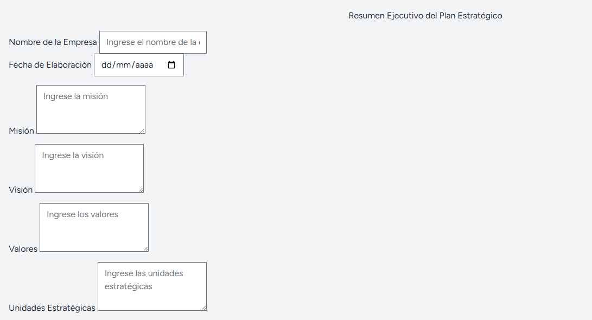

## Curso: Planeamiento Estrategico de PETI
**Docente: Dr. Oscar J. Jimenez Flores**

### "Examen Práctica Unidad II - PETI", "Royser Alonsso Villanueva Mamani", 28/05/2025

### "URLGithub: https://github.com/royservillanueva2004/PE_II_EXAMEN_PRACTICO.git"

Captura de la mejora

Se realiza la vista de Resumen del Plan Estrategico.
